<div align="center">

<picture>
  <source media="(prefers-color-scheme: dark)" srcset="assets/brand/lockup_dark.png">
  <source media="(prefers-color-scheme: light)" srcset="assets/brand/lockup_light.png">
  
</picture>

### Turn your Google Timeline into a cinematic map video.

Import your location history, pick a period and a look, then press **Render**. TimelinerX flies the camera along everywhere you've been and exports an MP4. Everything runs on your own computer.

[](https://github.com/NuRichter/TimelinerX/releases/latest)
[](https://github.com/NuRichter/TimelinerX/releases)
[](LICENSE)


**[Download](https://github.com/NuRichter/TimelinerX/releases/latest)** · **[Android](#-android)** · **[Features](#-features)** · **[Themes](#-themes)** · **[Quick start](#-quick-start)** · **[CLI](#-command-line)** · **[FAQ](#-faq--troubleshooting)**

<br>

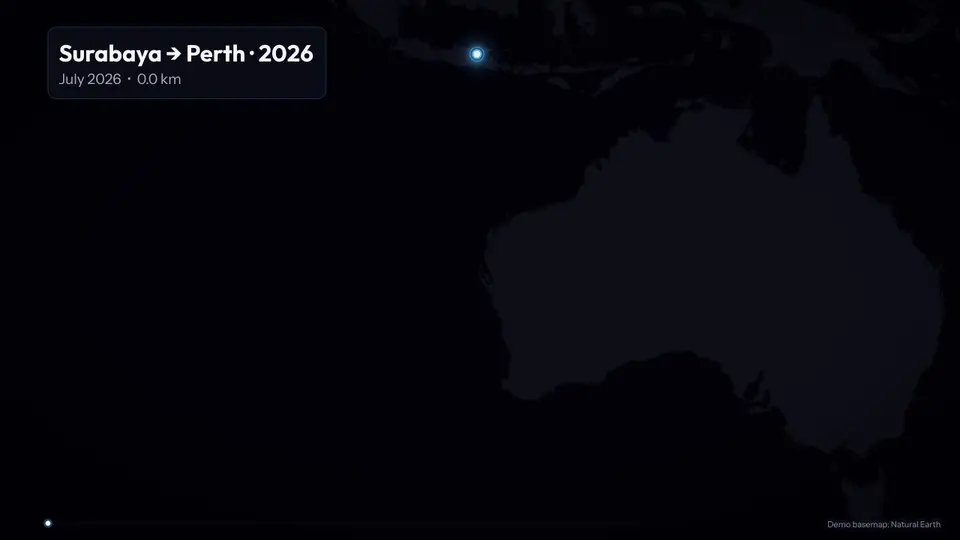

<sub>10 days, 6,602 km, rendered in one pass. Car and train legs trace the road, and flights fly as arcs with a plane marker.<br>
Synthetic demo data, theme <i>Neon Dark Blue</i>, offline demo basemap. The default basemap is CARTO.</sub>

</div>

---

## 📱 Android

TimelinerX also runs **on your phone**: import `Timeline.json` straight from *Settings → Location → Timeline*
(or share it to the app), build the journey, preview it live and render an MP4 into
*Gallery › Movies › TimelinerX*. The Android app uses the same camera engine (`tlx-2.0.0`, verified
frame-for-frame against this Python engine on all fixtures), the same 11 themes and the same `.nrproj`
projects, plus an **Offline World** map that needs no API key and no internet.

The APK is built by GitHub Actions (*Android APK* workflow) and attached to releases. Source, build
steps and signing setup: **[`android-app/README.md`](android-app/README.md)**.

---

## ✨ Features

<table>
<tr>
<td width="50%" valign="top">

### 🧭 Journey Builder
Choose a period and a **zoom style** (Fixed · Balanced · Active · Close-Up). Tune **long-trip detection**, **local framing** and **pacing**, and watch a live route sketch with calm and lively duration estimates.

</td>
<td width="50%" valign="top">

### 🎥 A camera that behaves like a camera
Pacing follows *visual motion*, so long flights don't dominate the video and short commutes stay visible. The camera uses zero-phase smoothing, rule-of-thirds lead room, eased intro and outro, and **Director's Cut** keyframes. Smoothness is **measured** in the test suite.

</td>
</tr>
<tr>
<td valign="top">

### ✈️ Transport-aware routes
Walking, bike, car/bus, train, ferry and flight modes come straight from your export. Flights are drawn as great-circle arcs flown by a plane marker.

</td>
<td valign="top">

### 🎨 10 themes + your own
Light, Dark, five Neon variants, Neon Cyan, Monochrome and High Contrast. Each one is a JSON grading node graph, so you can write your own as a plugin.

</td>
</tr>
<tr>
<td valign="top">

### 📺 Up to 8K, any aspect ratio
Output from 480p to 8K, in 16:9, 9:16, 1:1 or a custom size, at 24/30/60 fps, in H.264 or HEVC. TimelinerX picks **NVENC → Quick Sync → AMF → software** automatically and tells you why it chose each one. HDR10 export is experimental.

</td>
<td valign="top">

### 🛡️ Renders that survive crashes
The render pipeline is a 15-node DAG with checkpoints. If the app, your PC or the power dies mid-render, it **resumes where it stopped**. Every output is verified before it goes into your library.

</td>
</tr>
<tr>
<td valign="top">

### 🩺 Diagnose & repair
Is your Timeline file broken, truncated or reversed? Ten repair passes produce HIGH / MEDIUM / LOW confidence fixes with an HTML report. Your original file is **never** modified.

</td>
<td valign="top">

### 🌏 10 languages
English, **Bahasa Indonesia**, Español, Français, Deutsch, Português (Brasil), Русский, العربية (RTL), 中文, 日本語. Dates, numbers and units in the video are localised too.

</td>
</tr>
</table>

<details>
<summary><b>…and more</b> (audio, compare mode, CLI, plugins)</summary>
<br>

- 🎵 **Your own soundtrack** (MP3/WAV/FLAC), with local beat detection so the ending lands on a beat, plus ducking under titles and a fade-out
- 🌀 **Cinematic motion blur** (180° shutter, adaptive sub-frames)
- 🆚 **Compare** two renders split-screen or back to back, e.g. *2024 vs 2025*
- 📂 **Watch folder**: drop a Timeline file in and get a video out
- 🧾 **Render queue** with ETA, render fps, CPU and memory, and a render-graph inspector
- 🎓 **Built-in import tutorial** (Android & iPhone), exportable as MP4
- 🧩 **Plugin SDK** for themes (JSON) and map providers (Python, opt-in)
- ⌨️ Full keyboard navigation, light & dark appearance, reduced-motion setting

</details>

---

## 🖥️ A look inside

<div align="center">

<picture>
  <source media="(prefers-color-scheme: dark)" srcset="docs/readme/ui-journey-dark.png">
  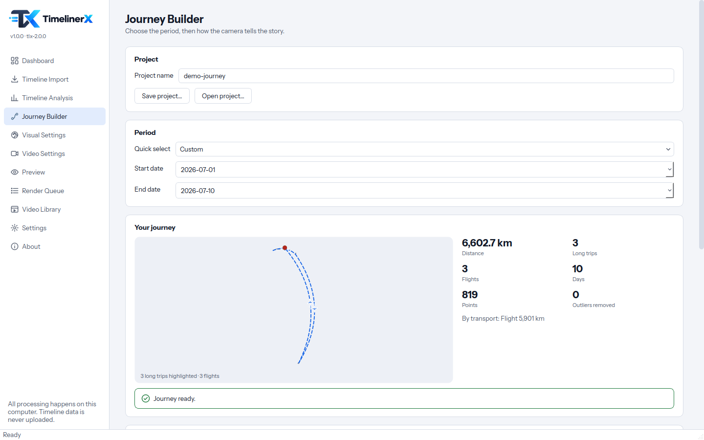
</picture>
<sub><b>Journey Builder</b>: period, distance, flights and long trips at a glance</sub>

</div>

<details>
<summary><b>📸 More screenshots</b> (Visual Settings, Preview, Analysis, Render Queue)</summary>
<br>

<table>
<tr>
<td width="50%">
<picture>
  <source media="(prefers-color-scheme: dark)" srcset="docs/readme/ui-visual-dark.png">
  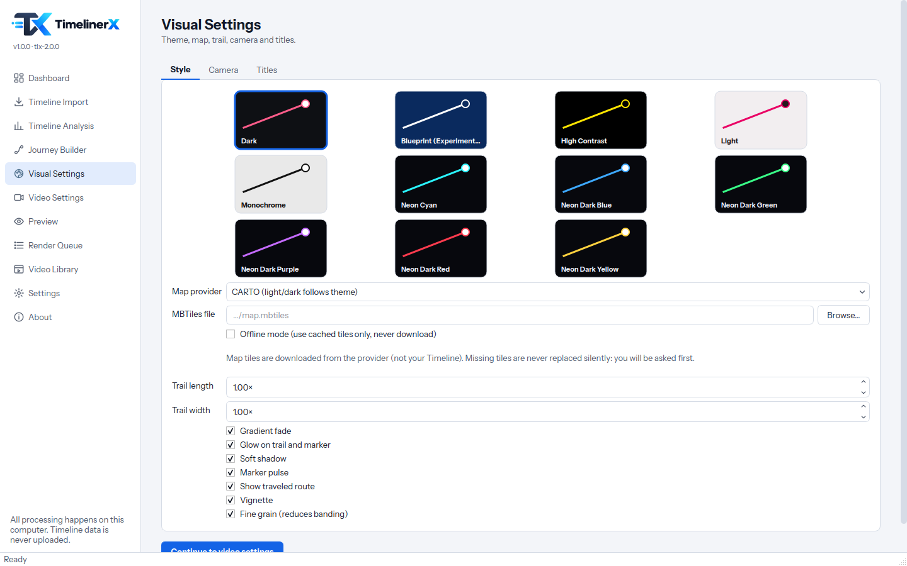
</picture>
<p align="center"><sub><b>Visual Settings</b>: themes, map, trail & effects</sub></p>
</td>
<td width="50%">
<picture>
  <source media="(prefers-color-scheme: dark)" srcset="docs/readme/ui-preview-dark.png">
  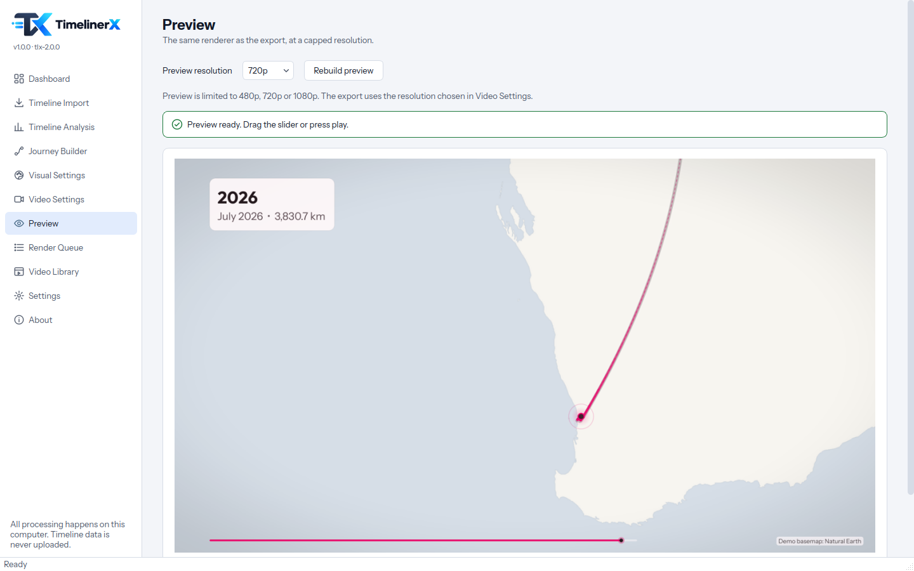
</picture>
<p align="center"><sub><b>Preview</b>: the same renderer as the export</sub></p>
</td>
</tr>
<tr>
<td width="50%">
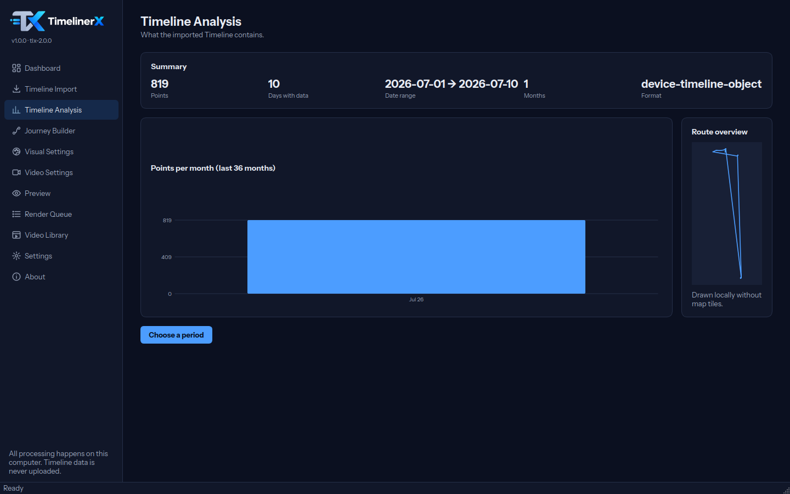
<p align="center"><sub><b>Timeline Analysis</b>: what your export contains</sub></p>
</td>
<td width="50%">
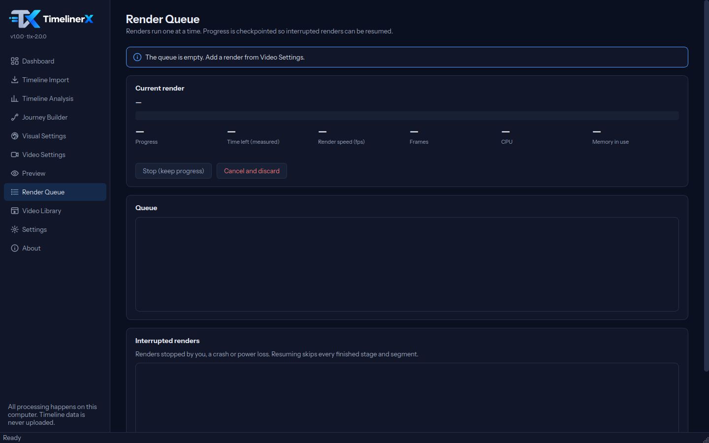
<p align="center"><sub><b>Render Queue</b>: resumable, checkpointed renders</sub></p>
</td>
</tr>
</table>

</details>

---

## 🎨 Themes

Click a theme to see it full size. All frames below come from the same moment of the same journey.

<table>
<tr>
<td align="center"><a href="docs/readme/themes/neon-dark-blue.png">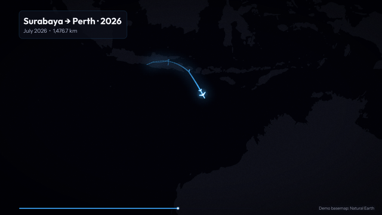</a><br><sub><b>Neon Dark Blue</b></sub></td>
<td align="center"><a href="docs/readme/themes/neon-cyan.png">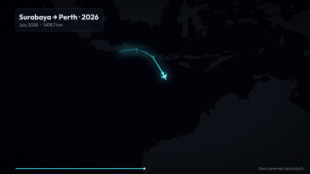</a><br><sub><b>Neon Cyan</b></sub></td>
<td align="center"><a href="docs/readme/themes/neon-dark-purple.png">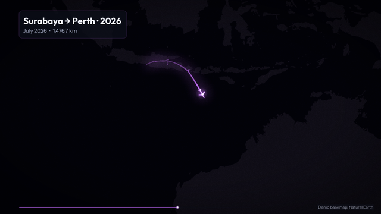</a><br><sub><b>Neon Dark Purple</b></sub></td>
</tr>
<tr>
<td align="center"><a href="docs/readme/themes/neon-dark-green.png">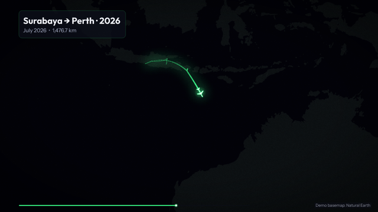</a><br><sub><b>Neon Dark Green</b></sub></td>
<td align="center"><a href="docs/readme/themes/neon-dark-red.png">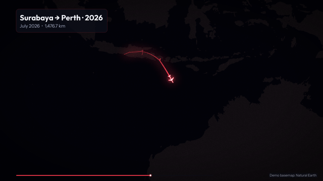</a><br><sub><b>Neon Dark Red</b></sub></td>
<td align="center"><a href="docs/readme/themes/neon-dark-yellow.png">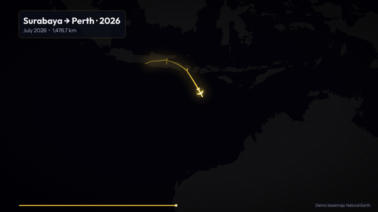</a><br><sub><b>Neon Dark Yellow</b></sub></td>
</tr>
<tr>
<td align="center"><a href="docs/readme/themes/light.png">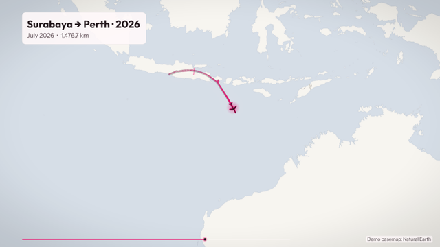</a><br><sub><b>Light</b></sub></td>
<td align="center"><a href="docs/readme/themes/dark.png">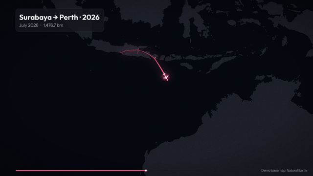</a><br><sub><b>Dark</b></sub></td>
<td align="center"><a href="docs/readme/themes/monochrome.png">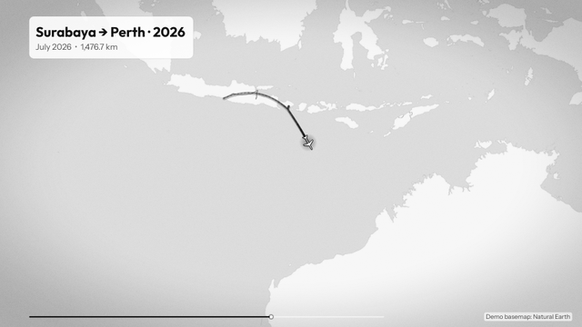</a><br><sub><b>Monochrome</b></sub></td>
</tr>
<tr>
<td align="center"><a href="docs/readme/themes/high-contrast.png">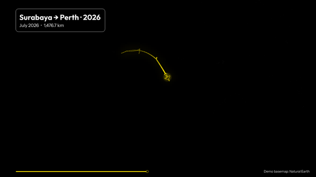</a><br><sub><b>High Contrast</b></sub></td>
<td align="center"><a href="docs/readme/themes/experimental-blueprint.png">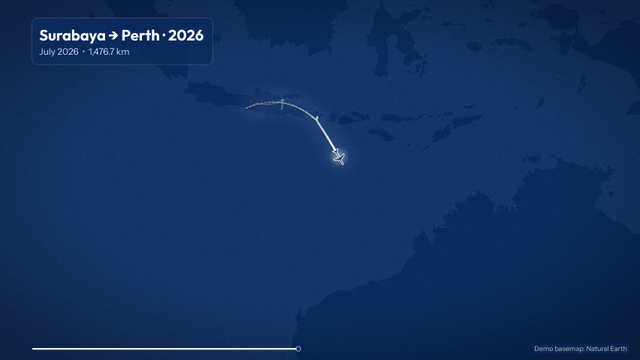</a><br><sub><b>Blueprint</b> <i>(experimental)</i></sub></td>
<td align="center" valign="middle"><sub>🧩 <b>Make your own</b><br>Copy <code>assets/themes/light.json</code><br>→ <a href="docs/PLUGINS.md">Plugin SDK</a></sub></td>
</tr>
</table>

### 📐 One journey, every format

<table>
<tr>
<td align="center" valign="bottom">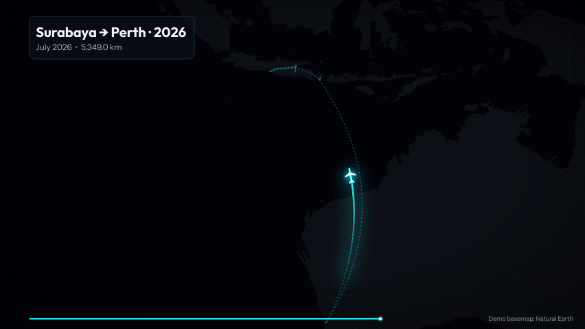<br><sub><b>16:9</b> · YouTube</sub></td>
<td align="center" valign="bottom">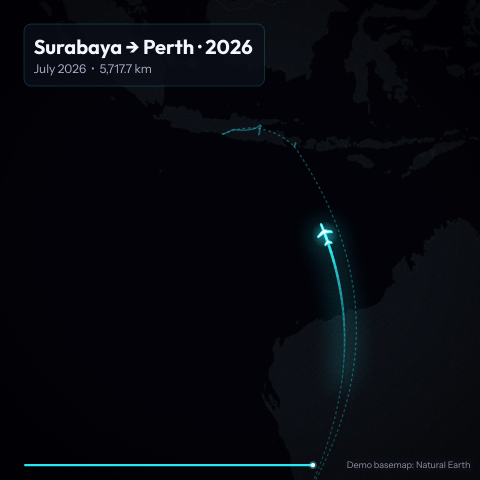<br><sub><b>1:1</b> · Feed</sub></td>
<td align="center" valign="bottom">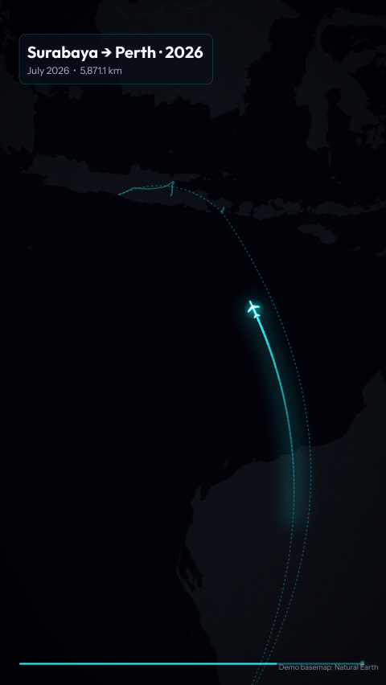<br><sub><b>9:16</b> · Reels / TikTok / Shorts</sub></td>
</tr>
</table>

<div align="center">
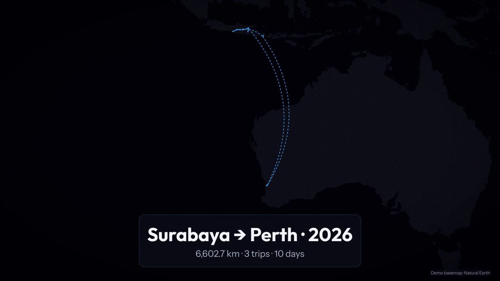
<br><sub>Every video ends with an <b>ending card</b>: total distance, trips and days, counting up.</sub>
</div>

---

## 🚀 Quick start

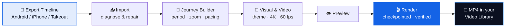

1. **Download** [`TimelinerX.exe`](https://github.com/NuRichter/TimelinerX/releases/latest). No installer and no Python needed.
2. **Install FFmpeg 5.1+** and point to it in *Settings → Rendering* (or add it to `PATH`).
3. **Add a free CARTO API key** in *Settings → Maps* ([get one here](https://carto.com/basemaps/apikey/)). If you'd rather skip this, use the *Plain* or *MBTiles* map.
4. **Export your Timeline** from your phone (the app has a built-in tutorial), then **Import** it.
5. Build the journey, choose a look, **Preview**, then **Render**. 🎉

> [!NOTE]
> Builds are not code-signed yet, so Windows SmartScreen will warn you on first launch. Click **More info → Run anyway**.

<details>
<summary><b>📱 How do I get my Timeline file?</b></summary>
<br>

Google Timeline now lives **on your phone**, not in the cloud.

| Phone | Where |
|---|---|
| **Android** | *Settings → Location → Location services → Timeline → Export Timeline data* → saves `Timeline.json` |
| **iPhone** | Google Maps → your profile picture → *Your Timeline* → ⋯ → *Location & privacy settings* → *Export Timeline data* |
| **Old Takeout** (before 2024) | The `.zip` from [takeout.google.com](https://takeout.google.com) works as is, including `Records.json` and *Semantic Location History* |

Menu names can differ slightly between phone brands and app versions. The in-app tutorial (Dashboard → *Import tutorial*) walks through both.

</details>

<details>
<summary><b>💻 System requirements</b></summary>
<br>

| | Minimum | Recommended |
|---|---|---|
| OS | Windows 10 64-bit (1809+) | Windows 11 64-bit |
| CPU | 2 cores | 6+ cores |
| RAM | 8 GB | 16 GB (32 GB for 2160p and above) |
| GPU | not required | NVIDIA / Intel / AMD with hardware H.264/HEVC |
| Disk | 2 GB free + ~2× the video size | SSD |
| Other | FFmpeg 5.1+ with ffprobe | FFmpeg 6/7 with libx264, libx265, zscale |

The in-app environment scan checks your machine and gives a *Comfortable / Heavy / Extreme* recommendation for each resolution.

</details>

<details>
<summary><b>🐍 Run from source</b> (Windows, macOS, Linux)</summary>
<br>

```bash
git clone https://github.com/NuRichter/TimelinerX.git
cd TimelinerX
python -m venv .venv
. .venv/bin/activate            # Windows: .venv\Scripts\activate
pip install -r requirements.txt
pip install -e .
timelinerx-gui                  # desktop app
timelinerx --help               # command line
```

</details>

<details>
<summary><b>🔨 Build the Windows executable</b></summary>
<br>

```powershell
build_windows.bat                      # venv, pinned deps, tests, PyInstaller
build_windows.bat -SkipTests -OneDir   # folder build (easier LGPL re-linking of Qt)
build_windows.bat -FFmpegDir C:\ffmpeg\bin -SignCert cert.pfx -SignPassword ****
```

Outputs: `dist\TimelinerX.exe` (GUI), `dist\timelinerx-cli.exe` (console) and `*.sha256` checksums.
CI (`.github/workflows/windows-build.yml`) runs the tests and builds both executables on `windows-latest`.

> [!WARNING]
> `build_windows.bat -CartoKey …` (or a local `carto_key.txt`) **embeds** a CARTO key in the `.exe`, and anyone with the file can extract it. For public releases, build without a key and let users enter their own.

</details>

---

## 🔒 Privacy, by design

<table>
<tr>
<td align="center" width="25%">🏠<br><b>Local only</b><br><sub>Your Timeline is read on your PC and never uploaded or copied</sub></td>
<td align="center" width="25%">🙅<br><b>No account</b><br><sub>No sign-in, no telemetry, no automatic update downloads</sub></td>
<td align="center" width="25%">🧹<br><b>Clean logs</b><br><sub>Coordinates in logs are replaced with <code>&lt;coord&gt;</code></sub></td>
<td align="center" width="25%">📴<br><b>Fully offline</b><br><sub>With the <i>Plain</i> or <i>MBTiles</i> map, TimelinerX makes zero network requests</sub></td>
</tr>
</table>

<details>
<summary>What <i>does</i> touch the network?</summary>
<br>

Only map tile requests to the tile server you choose (CARTO by default). These reveal *which map areas* a video shows. Use Plain, MBTiles or *Offline mode* to avoid them. Repair reports include the coordinates of the records they changed, so treat them as private.

</details>

---

## ⚙️ How it works

Every render runs as a DAG of 15 checkpointed nodes. Independent nodes run in parallel. Each result is fingerprinted, so a resume skips everything that's already done.

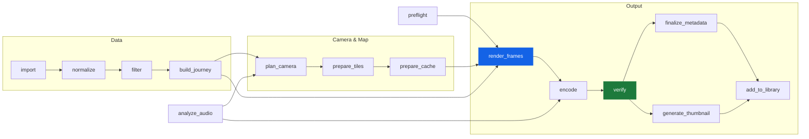

**Deterministic:** the same Timeline, project, map cache and engine version give identical frames (fixed grain seed, bundled fonts). Every video records its `render_engine_version`.
Want more detail? See [`docs/ARCHITECTURE.md`](docs/ARCHITECTURE.md) and [`docs/BENCHMARKS.md`](docs/BENCHMARKS.md).

<details>
<summary><b>🗂️ Supported Timeline formats</b></summary>
<br>

| Format | Source | Root |
|---|---|---|
| On-device Timeline (object) | Android export | `{"semanticSegments": [...], "rawSignals": [...]}` |
| On-device Timeline (array) | iOS Google Maps export | `[ {...segment...}, ... ]` |
| Takeout Records | Google Takeout (pre-2024) | `{"locations": [...]}` |
| Semantic Location History | Google Takeout (pre-2024) | `{"timelineObjects": [...]}` |
| Takeout `.zip` | Google Takeout | any of the above inside the archive |

Coordinates can be `"lat°, lon°"`, `"geo:lat,lon"`, wrapped objects or E7 integers. Timestamps can be offset, UTC, naive or epoch-ms. Files of 50 MB or more are streamed with resumable checkpoints.

</details>

<details>
<summary><b>🩺 Diagnose & repair passes</b></summary>
<br>

1. Forensic scan (encoding, BOM, NUL bytes, size)
2. Structural recovery (trailing data or commas, salvaging truncated files)
3. Schema normalisation (E7 in strings, epoch-ms)
4. Coordinate repair (out of range, Null Island, swapped lat/lon)
5. Timestamp repair (unparseable, implausible, end before start)
6. Ordering repair (newest-first exports)
7. Duplicate cleanup
8. Outlier analysis (teleports, MAD z-score of speed)
9. Semantic reconstruction
10. Validation (the repaired file is re-imported)

| Confidence | Meaning | Default |
|---|---|---|
| 🟢 **HIGH** | deterministic, provably correct | applied |
| 🟡 **MEDIUM** | heuristic or statistical | applied, can be unticked |
| 🔴 **LOW** | ambiguous (might be a real flight) | only if you tick it |

Output goes next to the source: `<name>.fixed.json` plus an HTML, JSON and text report. The original file is never overwritten.

</details>

---

## ⌨️ Command line

The CLI runs the same pipeline as the app. Use `timelinerx-cli.exe` on Windows, or `timelinerx` / `python -m timelinerx` from source.

```bash
# create a project and render it in 4K60 with the hardware encoder
timelinerx new-project --timeline Timeline.json --out trip.nrproj \
    --start 2026-07-01 --end 2026-07-10 --theme neon_cyan --zoom-style balanced
timelinerx render --project trip.nrproj --output trip.mp4 --resolution 2160p --fps 60 --encoder nvenc --json
```

<details>
<summary><b>All commands & exit codes</b></summary>
<br>

```text
new-project  --timeline T.json --out p.nrproj [--name --start --end --resolution --theme --zoom-style ...]
render       --project p.nrproj [--output --resolution --fps --encoder --two-pass --hdr --motion-blur
             --accept-fallback --allow-placeholder-tiles --overwrite --json]
resume       --job-dir <dir> [--json]
import       T.json                       # diagnostics as JSON
repair       T.json [--dry-run --accept-low --accept ID --reject ID --out-dir D]
preview      --project p.nrproj --out frame.png [--frame N --preview-resolution 720p]
compare      --a a.mp4 --b b.mp4 --out c.mp4 [--mode split|sequential --label-a 2025 --label-b 2026]
watch        --folder IN --preset p.nrproj --out-dir OUT [--once]
tutorial     # export the import tutorial as MP4
scan         [--no-hw-test]
themes | jobs [--clean] | exit-codes
```

With `--json`, progress is printed as JSON lines (`node_started`, `node_progress` with ETA and fps, `segment_committed`, `fallback`, `job_done`, `result`, `error`).

| Code | Meaning | Code | Meaning |
|---|---|---|---|
| `0` | success | `40` | storage |
| `2` | usage | `50` | map tiles |
| `10–13` | import | `60` | cancelled |
| `20` | project | `61` | render failed |
| `30–32` | FFmpeg / encoder / fallback consent | `62` | verification failed |
| | | `70` | plugin |

</details>

---

## ❓ FAQ & troubleshooting

<details>
<summary><b>"FFmpeg was not found"</b></summary>
<br>Install FFmpeg, set its folder in <i>Settings → Rendering</i> and click <b>Test</b>. Lookup order: Settings → <code>TIMELINERX_FFMPEG_DIR</code> → an <code>ffmpeg</code> folder next to the exe → <code>PATH</code>.
</details>

<details>
<summary><b>My map says "API KEY REQUIRED"</b></summary>
<br>Since 2026, CARTO watermarks every tile requested without a key. Get a free key (personal, research and non-profit use, 5M tiles/month) at <a href="https://carto.com/basemaps/apikey/">carto.com/basemaps/apikey</a> and paste it into <i>Settings → Maps</i>. TimelinerX refuses to render watermarked tiles rather than hand you a ruined video.
</details>

<details>
<summary><b>My GPU encoder isn't used</b></summary>
<br><i>Settings → Rendering → Test</i> shows each encoder's test-encode error. The usual cause is a missing or old GPU driver. H.264 hardware encoders max out at 4096 px, so use HEVC or libx264 for 8K.
</details>

<details>
<summary><b>Import says "not JSON" / "truncated"</b></summary>
<br>Run <b>Diagnose & repair…</b> and import the <code>.fixed.json</code> it writes.
</details>

<details>
<summary><b>The render was interrupted (crash, power cut)</b></summary>
<br>Go to <i>Render Queue → Interrupted renders → Resume</i>. From the CLI, run <code>timelinerx resume --job-dir …</code>. Frames that were already rendered are not redone.
</details>

<details>
<summary><b>Known limitations</b></summary>
<br>

- Hardware encoders (NVENC / Quick Sync / AMF) are selected only after a successful test encode, but they haven't been tested on real GPUs yet.
- Rendering is CPU-bound (Qt raster). Motion blur makes renders about 2–4× slower.
- HDR10 is experimental: the video is graded in SDR and placed in an HDR container.
- `.zip` imports restart from the beginning if they're interrupted. Plain `.json` imports resume.
- CJK, Arabic and Cyrillic text use system fonts, so glyph shapes depend on your installed fonts.

</details>

---

## 🙏 Credits & license

TimelinerX is released under the **[MIT License](LICENSE)**.

Parts of the parsing, projection, outlier filtering, trip detection, pacing and camera framing logic are adapted from
**[Google Timeline Visualizer](https://github.com/mahlernim/google-timeline-visualizer)** © 2025 mahlernim (MIT), then re-implemented for the desktop and extended.
[`THIRD_PARTY_NOTICES.md`](THIRD_PARTY_NOTICES.md) lists exactly which parts are derived, plus all dependencies, fonts and map data terms.
Map data © [OpenStreetMap](https://www.openstreetmap.org/copyright) contributors © [CARTO](https://carto.com/attributions).
The README demo uses synthetic data and a basemap drawn from [Natural Earth](https://www.naturalearthdata.com/).

<div align="center">
<br>


**Made with NuRichter Workspace**

[](https://www.linkedin.com/in/nurichter/)
[](https://github.com/NuRichter)

<sub>If TimelinerX turned your year into something worth watching, a ⭐ helps others find it.</sub>

</div>
