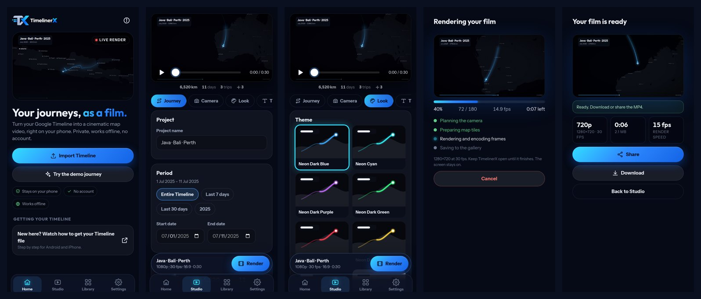

# TimelinerX for Android

Turn your Google Timeline into a cinematic map video, on your phone. Same camera engine as the
desktop app (`tlx-2.0.0`), same 11 themes, same `.nrproj` projects. No account, no upload.



| | |
|---|---|
| **Import** | Android `Timeline.json`, iPhone export, Google Takeout `.zip` (Records / Semantic Location History). Streamed, so big files stay light. Damaged or truncated files keep every complete record. "Open with" and the share sheet go straight into the app. |
| **Journey** | Period presets (whole Timeline, per year, last 7 / 30 days, custom), semantic or detailed route, GPS teleport filter, long-trip detection, transport modes, flights as arcs. |
| **Camera** | Fixed / Balanced / Active / Close-Up, long-trip pacing, local framing, rule-of-thirds, intro/outro, smoothing. Frame-for-frame identical to the desktop planner (see *Parity*). |
| **Maps** | **Offline World** (Natural Earth coastlines, borders and 7,342 city names in 10 languages, zero network, no key), CARTO with your key, CARTO Voyager, Plain, or your own XYZ server. Every map is graded by the theme. |
| **Video** | 16:9, 9:16, 1:1 · 720p to 4K · 24/30/60 fps · H.264 through the phone's hardware encoder (MediaCodec via WebCodecs) · optional soundtrack with fade-out · saved to *Gallery › Movies › TimelinerX*. |
| **Languages** | English, Bahasa Indonesia, Español, Français, Deutsch, Português (Brasil), Русский, العربية (RTL), 中文, 日本語. |

## Get the APK

Every push to `android-app/` runs **GitHub Actions → Android APK** and uploads `TimelinerX-*.apk` as a
workflow artifact. Pushing a tag like `v1.0.0` also attaches the APK to a GitHub Release.

Without signing secrets CI builds a *debug* APK: it installs fine, but every CI run signs with a
different debug key, so an update needs an uninstall first. For stable, updatable releases create a
keystore once and add four repository secrets:

```bash
keytool -genkeypair -v -keystore timelinerx-release.jks -alias timelinerx \
        -keyalg RSA -keysize 4096 -validity 10000
base64 -w0 timelinerx-release.jks > keystore.b64     # macOS: base64 -i timelinerx-release.jks
```

| Secret | Value |
|---|---|
| `ANDROID_KEYSTORE_BASE64` | contents of `keystore.b64` |
| `ANDROID_KEYSTORE_PASSWORD` | keystore password |
| `ANDROID_KEY_ALIAS` | `timelinerx` |
| `ANDROID_KEY_PASSWORD` | key password |

Keep the `.jks` file and passwords safe: losing them means users cannot update to your next build.

Optional: `TIMELINERX_CARTO_KEY_EMBED` bakes a CARTO key into the APK. Anyone with the APK can extract
it, so leave it unset for public builds (users paste their own free key in *Settings*).

## Build locally

Requirements: Node 22+, JDK 21, Android SDK platform 36 (Android Studio installs it).

```bash
cd android-app
npm ci
npm test                 # engine parity with the desktop app, importer, i18n
npm run build            # web app -> dist/
npx cap sync android     # copies dist/ into the Android project
cd android && ./gradlew assembleDebug
# -> android/app/build/outputs/apk/debug/app-debug.apk
```

Or open `android-app/android` in Android Studio and press Run. `npm run dev` runs the whole app in a
desktop browser too (videos download instead of going to the gallery).

## How it works

```
Timeline.json / .zip ─► streaming scanner ─► extractor ─► journey ─► camera planner (worker)
                                                                        │
       Offline World / CARTO tiles ─► theme grading ─► Canvas 2D frame renderer ─► WebCodecs H.264
                                                                        │                 │
                                                        live preview ◄──┘      MP4 (fast start) ─► MediaStore
```

* `src/engine/` is a line-by-line port of the desktop Python engine (parser, outliers, journey, pacing,
  camera planner). It runs in a Web Worker so the UI stays smooth.
* `src/render/` ports the Qt frame renderer to Canvas 2D: gradient trail, bloom, marker, plane,
  typography, date ribbon, vignette, grain. The preview and the export use the same renderer.
* `src/export/encoder.js` feeds frames to `VideoEncoder` and muxes a fast-start MP4 that is streamed to
  storage in positional chunks (so long 4K videos never have to fit in RAM).
* `android/app/src/main/java/com/nurichter/timelinerx/TlxNativePlugin.java` writes the MP4, copies it
  into the gallery, shares/opens it, keeps the screen on while rendering and receives shared Timeline files.

## Parity with the desktop engine

`test/parity.test.js` imports all 24 desktop fixtures (copied into `test/fixtures/`, so the Android app builds on its own) and compares against reference output produced by
the Python engine (`scripts/parity_reference.py`): point counts, timestamps, coordinates, transport
modes, trip legs, flight arcs, outliers and days are identical, and camera plans (4 zoom styles, 16:9
and 9:16) match within 1e-6 of the viewport. `test/grading.test.js` checks all 11 theme graders against
the numpy pipeline pixel by pixel.

## Privacy

Your Timeline is read on the phone and never modified or uploaded. With the Offline World or Plain map
the app makes no network requests at all. CARTO/XYZ maps only download map tiles (they reveal which
map areas a video shows). Tiles are cached, rate-limited to 8 requests/s and requested with your own key.

## Known limitations

* Rendering runs in the foreground: keep the app open until the video is saved (the screen stays on).
* Not ported from desktop yet: the 10-pass repair wizard (truncated files are salvaged automatically),
  motion blur, HDR10, beat-synced endings and the Director's-Cut keyframe editor (keyframes inside an
  imported `.nrproj` are still honoured).
* 4K needs a phone with plenty of memory and a 4K-capable hardware encoder; the resolution chips grey out
  sizes the phone reports it cannot encode.

## Regenerating data

```bash
python scripts/build_themes.py ../assets/themes             # themes from the desktop JSON
python scripts/build_i18n.py ../src/timelinerx/i18n         # desktop strings used by the app
python scripts/build_android_strings.py                     # Android strings (10 languages, checked)
python scripts/build_world.py <natural-earth-geojson-dir>   # Offline World basemap (needs shapely)
python scripts/make_android_assets.py ../assets/brand       # launcher icons and splash
```

Made with NuRichter Workspace · [LinkedIn](https://www.linkedin.com/in/nurichter/) · [GitHub](https://github.com/NuRichter) · MIT License
